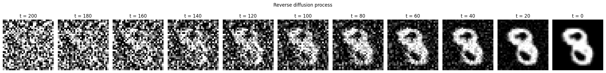
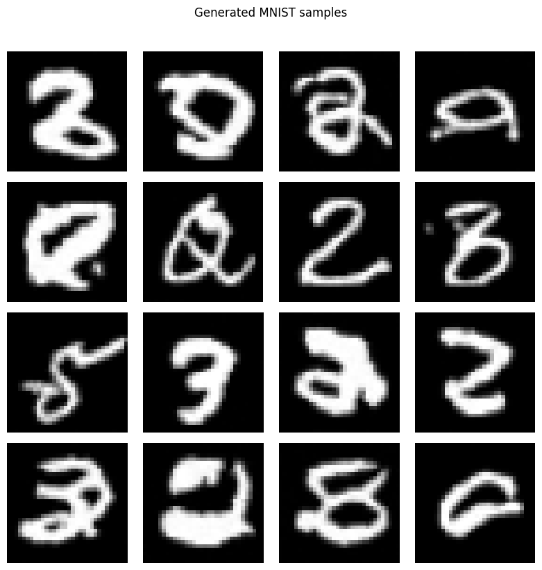
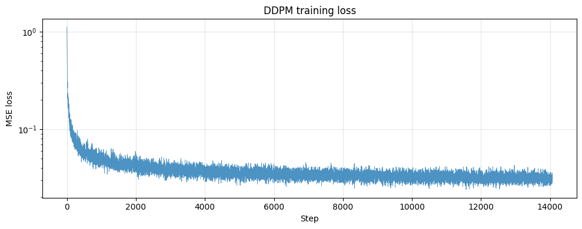

# diffusion-from-scratch

An educational implementation of **Denoising Diffusion Probabilistic Models (DDPM)** in raw PyTorch, with notebooks that derive the math from first principles and an end-to-end training and sampling pipeline.

<p align="center">
  
  <br />
  <em>The reverse diffusion process: pure Gaussian noise at <code>t=200</code> gradually resolves into an MNIST digit at <code>t=0</code>.</em>
</p>

## Overview

This project rebuilds the core machinery of [Ho et al. (2020), *Denoising Diffusion Probabilistic Models*](https://arxiv.org/abs/2006.11239) from the ground up in PyTorch — no high-level diffusion libraries — and uses it to train an unconditional generative model on MNIST.

It accompanies my MSc thesis on latent diffusion models for medical CT image synthesis at the [Chair of Biomedical Physics, TU Munich](https://www.ph.nat.tum.de/e17/publications/thesis-projects/), and is intended both as a clean reference implementation for learners and as part of my public research portfolio.

The repository is organized as a sequence of self-contained Jupyter notebooks, each focused on one part of the system:

1. The forward (noising) process and its closed-form expression.
2. The U-Net architecture, built up module by module.
3. Training the U-Net to predict noise (DDPM Algorithm 1).
4. The reverse (denoising) process and sample generation.

## Method

### Forward process

A diffusion model defines a Markov chain that gradually corrupts an image $x_0$ into pure noise $x_T$:

$$
q(x_t \mid x_{t-1}) = \mathcal{N}\big(x_t;\, \sqrt{1 - \beta_t}\, x_{t-1},\, \beta_t I\big)
$$

A key property — derived in [notebook 01](notebooks/01-forward-process.ipynb) — is that we can sample $x_t$ directly from $x_0$ without iterating step by step:

$$
x_t = \sqrt{\bar{\alpha}_t}\, x_0 + \sqrt{1 - \bar{\alpha}_t}\, \epsilon, \quad \epsilon \sim \mathcal{N}(0, I)
$$

where $\bar{\alpha}_t = \prod_{s=1}^{t}(1 - \beta_s)$. This closed form is what makes training tractable.

### Reverse process

The trained network predicts $\epsilon_\theta(x_t, t)$, the noise that was added to produce $x_t$. One reverse step is then

$$
x_{t-1} = \frac{1}{\sqrt{\alpha_t}}\left(x_t - \frac{\beta_t}{\sqrt{1 - \bar{\alpha}_t}}\, \epsilon_\theta(x_t, t)\right) + \sigma_t\, z, \quad z \sim \mathcal{N}(0, I)
$$

with $\sigma_t = \sqrt{\beta_t}$. Sampling starts from $x_T \sim \mathcal{N}(0, I)$ and applies this step $T$ times (no noise added on the final $t=0$ step).

### Architecture

The noise-prediction network is a U-Net with three resolution levels:

- **Sinusoidal time embeddings** (transformer-style positional encoding) to condition on $t$.
- **Residual blocks** with GroupNorm + SiLU activations and a time-projection MLP that injects the time embedding between the two convolutions.
- **Down / up sampling** via stride-2 convolutions and nearest-neighbor upsampling.
- **Skip connections** between matching down and up levels.

For 32×32 grayscale inputs with `channel_mults = (1, 2, 4)` and `base_channels = 32`, channel widths are `[32, 64, 128]` and the total parameter count is **~1.1 million**.

Implementation lives in [`src/model.py`](src/model.py); [notebook 02](notebooks/02-unet-architecture.ipynb) walks through it module by module.

## Results

Trained for **30 epochs** on MNIST at $T = 200$ with a linear $\beta$ schedule, batch size 128, Adam lr = 2e-4.

### Generated samples

<p align="center">
  
</p>

After 30 epochs the model produces clearly digit-shaped samples — multiple distinct digits, correct stroke topology, MNIST-like contrast and resolution. A subset of samples collapses to ambiguous shapes; this is a known failure mode of small DDPMs that improves with larger architectures and longer training (see [Limitations](#limitations)).

### Training loss

<p align="center">
  
</p>

Loss drops sharply in the first few hundred steps (the model quickly learns the average noise distribution), then descends slowly as it learns to predict noise at specific timesteps. Final epoch average MSE loss settles around **0.03**.

## Repository structure

```
diffusion-from-scratch/
├── notebooks/
│   ├── 01-forward-process.ipynb      # Closed-form noising + visualization
│   ├── 02-unet-architecture.ipynb    # U-Net built from time embeddings up
│   ├── 03-training.ipynb             # Training the U-Net (Algorithm 1)
│   └── 04-sampling.ipynb             # Reverse process + sample generation
├── src/
│   ├── __init__.py
│   └── model.py                      # SinusoidalTimeEmbedding, ResBlock, UNet
├── weights/
│   └── ddpm_mnist_weights.pt         # Trained weights (~4 MB)
├── figures/                          # Result figures used in this README
│   ├── denoising_process.png
│   ├── generated_samples.png
│   └── training_loss.png
├── LICENSE
└── README.md
```

## Setup and reproducing

The notebooks were developed on Kaggle (free T4 GPU) but will run anywhere with a CUDA-capable GPU and a recent PyTorch.

**Dependencies:** `torch`, `torchvision`, `matplotlib`. No diffusion-specific libraries.

**To run inference with the included weights:**

Open [`notebooks/04-sampling.ipynb`](notebooks/04-sampling.ipynb). The notebook clones this repo, imports `UNet` from `src/model.py`, loads `weights/ddpm_mnist_weights.pt`, and generates samples in ~10 seconds.

**To retrain from scratch:**

Open [`notebooks/03-training.ipynb`](notebooks/03-training.ipynb). The notebook trains the U-Net for 30 epochs on MNIST and saves the weights. Training takes ~20 minutes on an NVIDIA T4.

For production-scale models, trained weights would normally live on Hugging Face Hub rather than in Git; the weights are included here because the file is small (~4 MB) and makes the project immediately reproducible.

## Limitations

The implementation focuses on the algorithmic core and is deliberately small. Compared to the DDPM paper:

- **Model size**: 1.1M parameters vs. ~100M+ in the paper. Larger architectures produce visibly crisper samples.
- **Timesteps**: $T = 200$ for faster training; the original paper uses $T = 1000$, which gives a more saturated noise distribution at $t = T$ and finer denoising granularity.
- **Training duration**: 30 epochs on a small model; the paper trains for orders of magnitude more compute.
- **No EMA**: production DDPM training maintains an exponential moving average of the weights for sampling, which noticeably improves sample quality.
- **MNIST only**: the same code should generalize to CIFAR-10 with `channels=3` and a deeper architecture, but this hasn't been validated.

Each of these would be a natural follow-up extension.

## References

- Ho, J., Jain, A., & Abbeel, P. (2020). *Denoising Diffusion Probabilistic Models*. [arXiv:2006.11239](https://arxiv.org/abs/2006.11239)
- [`lucidrains/denoising-diffusion-pytorch`](https://github.com/lucidrains/denoising-diffusion-pytorch) — clean reference implementation
- [`huggingface/diffusers`](https://github.com/huggingface/diffusers) — production-grade diffusion library

## Author

Built by [Hrithik Barua](https://github.com/baruahrithik). This project accompanies my MSc thesis, *Synthesis of Artificial Medical X-ray CT Images through Generative Models*, completed at the Chair of Biomedical Physics, TU Munich, 2025 ([listed at E17](https://www.ph.nat.tum.de/e17/publications/thesis-projects/)).

## License

MIT — see [LICENSE](LICENSE).
